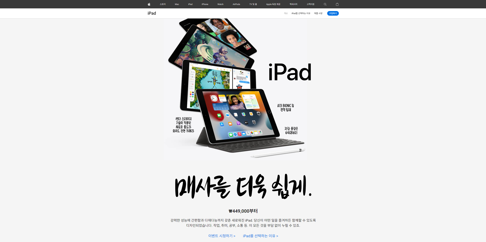

[](https://apple-ipad-project.vercel.app/)

## 📸 프로젝트 미리보기


## 🔗 배포 링크
👉 [https://apple-ipad-project.vercel.app](https://apple-ipad-project.vercel.app)

## 🧑‍💻 사용한 기술 스택
- HTML / CSS / JavaScript
- Vercel (배포)

## ✨ 프로젝트 개선 포인트
1. **접근성 개선**
    - 기존 방법  
    ```css
    .bgtext {
        display: block;
        text-indent: -9999px;
        background-position: center;
        background-repeat: no-repeat;
        background-size: contain;
      }
    ```  
    - 개선 방법  
    ```html
      <li class="search-starter">
        <!-- 스크린 리더가 읽는 용도 -->
        <span class="visually-hidden">검색</span>
        <!-- 실제 화면에 표시되는 이미지 or 아이콘 -->
        <span class="visual-icon"></span>
      </li>
    ```
    ```css
      .visually-hidden {
        position: absolute !important;
        width: 1px;
        height: 1px;
        padding: 0;
        margin: 0;
        overflow: hidden;
        clip: rect(0 0 0 0);
        white-space: nowrap;
        border: 0;
        clip-path: inset(100%);
      }
    ```
    `text-indent: -9999px` 방법은 옛날 방식이기도 하고 화면 밖으로 **날려버리는 방식**으로 화면 리더(Screen Reader)에서 간혹 위치를 인식하지 못하여 무시해버리는 경우가 생길 수 있어 레이아웃이 무너지는 등 비정상적으로 작동 할 가능성이 있었다.

    반면에, `.visually-hidden` 클래스를 새로 명시하여 위 코드처럼 `1px` 단위로 작게 만들고 `clip` 관련 명령어로 **완전히 접어버리는 형태**로 만들고 `overflow`로 넘치는 부분은 다 잘라버리게 만들어 영역은 존재하나 표시되지 않게 만들었기에 레이아웃도 무너지는 경우도 없고 화면 리더(Screen Reader)에서도 영역이 안에 존재하기에 충분히 읽을 수 있도록 하였다.

    무엇보다 Tailwind에서도 사용하는 방식이였고 의도의 명확성이 확실하고 유지보수도 좋아서 개선했다.

2. **레이아웃 문제 해결**
    - 특정 넓이 구간에서 오른쪽 `body` 밖으로 여백이 생김 (가로 스크롤 생성)
        1. 애니메이션을 위한 `translate` 사용으로 화면 밖으로 밀려남
            ```css
              .box {
                opacity: 0;
                visibility: hidden;
                tranform: translateX(100px);
              }
              .box.on {
                opacity: 1;
                visibility: visible;
                tranform: translateX(0);
              }
            ```
            일반적인 상황이였다면 부모 영역에서 `overflow-x: hidden;`으로 처리하여 문제를 해결 할 수 있었으나 해당 프로젝트에서 `<header>` 안에 자식 요소인 `.basket`, `.autocompletes` 같이 부모 기준으로 `top: 100%`로 헤더 바로 밑에 붙어야 되는 경우에서 사용 되었을 때, X축 기준으로 자르는 상황임에도 불구하고 Y축에 존재하는 자식 요소들이 다 짤리는 현상이 생겼다.  
            (GPT의 도움으로 이유를 찾아보니 렌더링 과정에서 헤더 영역 밖에 나간 자식 요소들에 `transform`, `absolute`, `top: 100%` 이런 경우에 `overflow-x` 임에도 브라우저는 부모 영역 밖으로 나갔다는 이유로 Y축까지 처리해버리는 경우가 생기는 경우가 있다고 한다.)

        2. `.visually-hidden` 사용 중에 `margin: -1px`로 브라우저가 넘침이 생겼다고 판단
            ```css
              .visually-hidden {
                position: absolute;
                width: 1px;
                height: 1px;
                padding: 0;
                margin: -1px;
                clip: rect(0 0 0 0);
                white-space: nowrap;
                border: 0;
              }
            ```
            `.visually-hidden`을 개선하기 전 코드에서 `margin: -1px`로 인하여 브라우저가 인식할 때, 이탈했다고 판단하여 overflow가 생겨 메뉴에 있던 `.visually-hidden` 요소 만큼 약 `3~5px` 정도 여백이 생기는 현상이 생겼다.

    - 해결 시도  
        1. `<html>`,`<body>`에 `overflow-x: hidden`을 적용하여 해결 되나 했으나, `<nav>`에 `sticky`가 풀려서 사용 불가했다.
        2. 자식 요소들을 `fiexd` 로 해결 하려 했으나, 반응형 처리하기엔 위치 조정이 어려웠다.
    
    - 해결 방법  
        1. `clip-path`, `scaleX` 를 활용하여 애니메이션 처리를 변경
        2. `.visually-hidden` 코드 개선

3. **JavaScript 리팩토링**
    - 불필요한 이벤트 중복 제거
    - 자식 요소 클릭 이벤트와 window 클릭 이벤트 둘다 사용하여 이벤트 버블링 방지 추가  
    (최대한 자식 요소의 root 기준으로 처리)
    - 반복 코드 함수화 및 조건문 정리
    - `reverse()` 함수는 원본 데이터를 바꾸는 개념으로 **얕은 복사(스프레드)** 방식으로 처리
    - 푸터 네비게이션 window 처음 페이지 접속 시, 넓이 계산하여 클릭 이벤트 추가, 제거 제어  
    (리사이징 처리는 당장은 필요 없다고 생각하여 따로 처리 X)
    - `Locale` 부분 JS로 처리

> 💡 기본 강의 내용을 바탕으로 *실제 실무에 가깝도록 수정 및 개선*한 점에 중점을 두었습니다.
